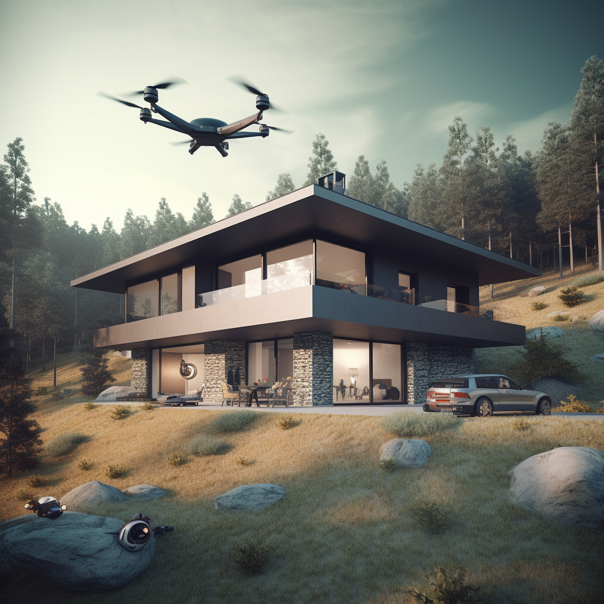

# Drone Security (AIC)

- Authors: Ron Holzapfel, Bastian Berle
- Link: https://github.com/C2G-BR/Drone-Security
- Technologies: Python, Arduino

Drone Security, also known as AIC Security, is a home security system that utilises drones to keep your home in safe and sound condition.