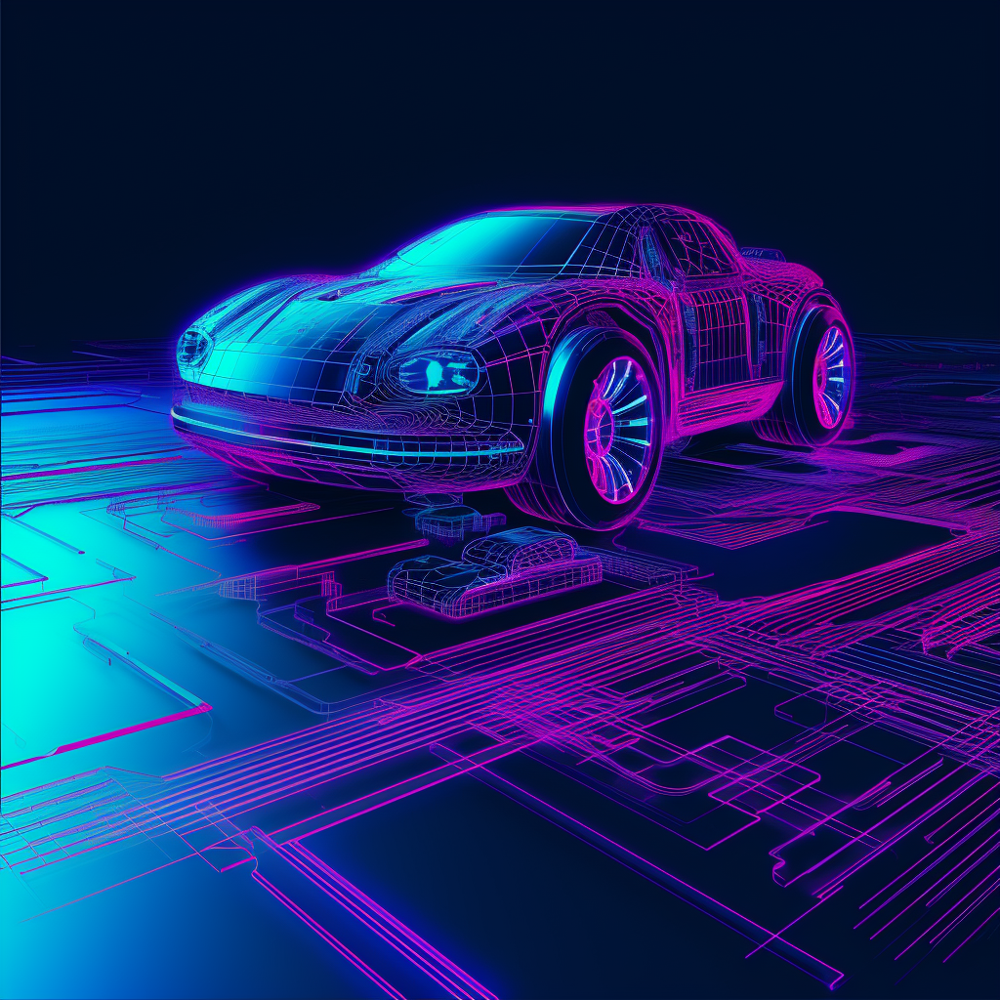

# Active Lane Keeping Assistant (ALKA)

- Authors: Ron Holzapfel, Bastian Berle
- Link: https://github.com/C2G-BR/Active-Lane-Keeping-Assistant
- Technologies: Python, Computer Vision, Autonomous Driving

The Active Lane Keeping Assistant is designed to control vehicles by means of computer vision for lane recognition. A PID controller is used to drive the system.