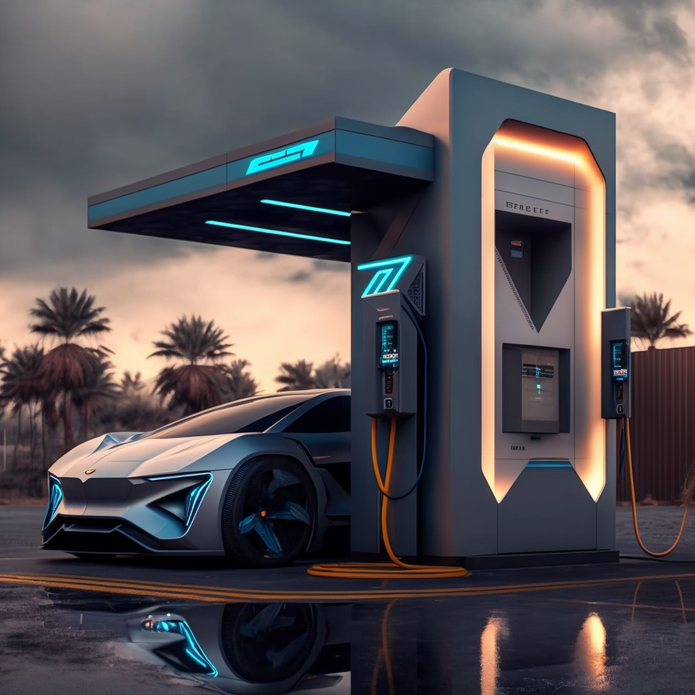

# Intelligent Charging Station

- Authors: Ron Holzapfel, Bastian Berle, FHeidger
- Link: https://github.com/C2G-BR/Intelligent-Charging-Station
- Technologies: Python, Reinforcement Learning, Flask

The Intelligent Charging Station is a digital twin of an electric vehicle charging station. It helps to optimise the distribution of charging power to all vehicles at the charging points.