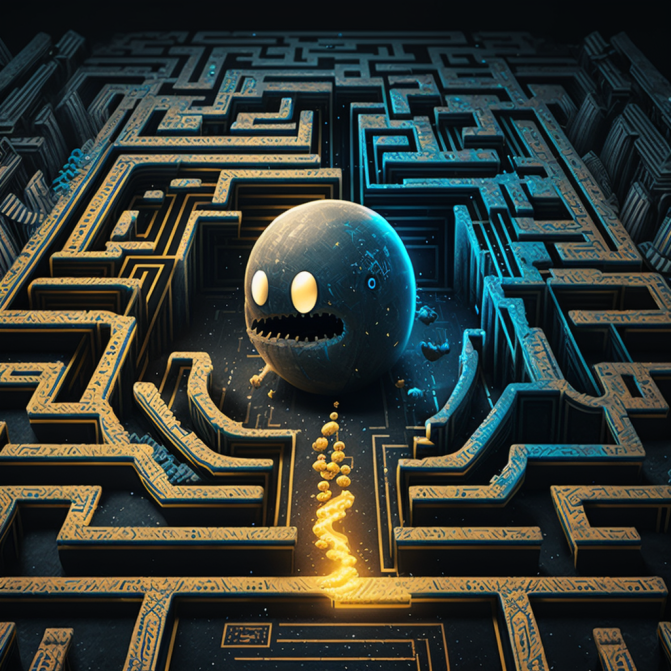

# Pac-Man - AI

- Authors: Ron Holzapfel, Bastian Berle
- Link: https://github.com/C2G-BR/Pac-Man-AI
- Technologies: Python, Reinforcement Learning

Pac-Man - AI implements the well-known game of Pac-Man. The game is solved using Deep Q-Networks, a reinforcement learning algorithm.